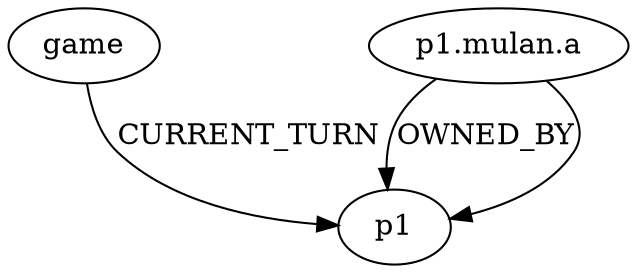

# Architecture

Graph-based game state engine with filesystem persistence. Designed for game tree exploration, replay, and ML training data generation.

## Core Concepts

### Game State as Directed Graph

Game state represented as a **NetworkX MultiDiGraph**, serialized to DOT format.

**Nodes** represent game entities:
- Game metadata (turn counter, game over state)
- Players (lore, ink resources)
- Steps (turn phases: ready, set, draw, main, end)
- Card instances (created when drawn from deck)

**Edges** represent relationships and legal actions:
- **Structural**: `CURRENT_TURN`, `CURRENT_STEP`, `OWNED_BY` (card ownership)
- **Legal actions**: `CAN_PASS`, `CAN_INK`, `CAN_PLAY`, `CAN_QUEST`, `CAN_CHALLENGE`

Legal action edges are **computed from game rules** and stored on the graph, making the state self-documenting.

### Filesystem as Game Tree

```
output/<matchup-hash>/<shuffle-seed>/<action>/<action>/...
                                     └─ sequential action IDs (0, 1, 2...)
```

**Each directory = one game state**:
- `game.dot` - Complete graph (nodes + edges)
- `actions.txt` - Available actions from this state
- `diff.txt` - What changed from parent state
- `deck1.dek`, `deck2.dek` - Remaining cards in deck

**Tree structure**:
- Root: initial game state after shuffle
- Branches: alternate move sequences
- Leaves: games in progress (explored but not continued)

### Lazy State Computation

States only exist when explored:
1. Navigate to `output/.../0/1/2/`
2. If `game.dot` doesn't exist → load parent, apply action, save result
3. Recursive: automatically builds missing parent states

**Benefits**:
- Sparse storage (only explored paths)
- Parallel exploration (each state independent)
- Natural caching (once computed, reused)

### Deterministic Replay

**Matchup hash**: MD5 of deck contents → same decks = same hash
**Shuffle seed**: Hand specification (which cards go to each player) + RNG seed
**Action sequence**: Sequential indices, deterministically sorted

`same decks + same seed + same actions = identical game state`

Perfect for:
- Reproducible experiments
- Bug reports with exact game state
- Training data with consistent labeling

## Data Structures

### Node Schema

| type     | attributes                                       |
| -------- | ------------------------------------------------ |
| `Game`   | `turn`, `game_over`, `winner`                    |
| `Player` | `lore`, `ink_drops`, `ink_total`, `ink_available`|
| `Step`   | `player` (p1/p2), `step` (ready/set/draw/main/end) |
| `Card`   | `label`, `zone`, `exerted`, `damage`, `strength`, `willpower` |

**Card nodes** created when drawn from deck. Zone is an attribute (`hand`, `play`, `ink`, `discard`).

**Step nodes** (10 total: `step.p1.ready` through `step.p2.end`) represent turn phases. Used for temporal effects ("until end of turn").

### Edge Schema

**Structural**:
- `CURRENT_TURN`: Game → Player (whose turn)
- `CURRENT_STEP`: Game → Step (current phase)
- `OWNED_BY`: Card → Player (ownership)

**Action** (computed by rules engine):
- `CAN_PASS`: Player → Game (end turn)
- `CAN_INK`: Card → Player (add card to inkwell)
- `CAN_PLAY`: Card → Player (play from hand)
- `CAN_QUEST`: Card → Player (quest for lore)
- `CAN_CHALLENGE`: Card → Card (attacker → defender)

Each action edge has `action_type`, `action_id`, and `description` attributes.

### Action IDs

Sequential integers (0, 1, 2...) assigned deterministically:
1. Collect all legal actions
2. Sort by `(action_type, from_node, to_node)`
3. Enumerate → assign indices

**Properties**:
- No collisions
- Stable across runs (deterministic sort)
- Easy indexing for ML (`actions[0]`, `actions[1]`)

### File Formats

**game.dot** (DOT/Graphviz):


**actions.txt** (available moves):
```
0: quest:p1.mulan.a
1: ink:p1.elsa.b
2: pass
```

**diff.txt** (changes from parent):
```
# turn: 3
# current_player: p1
# action: play:p1.mulan.a
set node p1.mulan.a zone=play
```

**deck.dek** (cards remaining in deck):
```
p1.card_name.a
p1.card_name.b
```

## State Lifecycle

```
1. Initialize (match)
   ├─ Load template graph (players, steps)
   ├─ Hash deck contents → matchup ID
   └─ Save: output/<hash>/game.dot

2. Shuffle (deterministic)
   ├─ Parse seed → which cards go to each hand
   ├─ Create card nodes with zone="hand"
   ├─ Compute legal actions → add CAN_* edges
   └─ Save: output/<hash>/<seed>/game.dot, *.dek

3. Play (on-demand)
   ├─ If game.dot exists → load and return
   ├─ Else: load parent, apply action, save
   ├─ Compute legal actions for new state
   ├─ Write actions.txt, diff.txt
   └─ Recursive: auto-builds missing parents
```

## Extension Points

### Adding New Mechanics

1. Create `lib/lorcana/mechanics/mechanic_name.py`:
   - `compute_can_X(G)` → list of legal action edges
   - `execute_X(state, from, to)` → mutate state graph

2. Register in `lib/lorcana/compute.py`:
   ```python
   edges_to_add.extend(compute_can_X(G))
   ```

3. Register in `lib/lorcana/execute.py`:
   ```python
   elif action_type == "CAN_X":
       execute_X(state, from_node, to_node)
   ```

Sequential action IDs assigned automatically.

### Custom Analysis Tools

All data accessible via standard tools:
- `find`, `grep` for filesystem queries
- NetworkX for graph analysis
- Shell scripts for batch processing
- DOT files viewable with Graphviz

### API/Programmatic Access

```python
from lib.lorcana.game_api import GameSession

# Load from existing file-based state
session = GameSession.from_file("output/b013/seed/0/1/2")

# Get available actions
actions = session.get_actions()  # [{'id': '0', 'description': '...'}, ...]

# Apply action by ID
session.apply_action("0")

# Play random until game ends
path = session.play_until_game_over()

# Check winner
if session.is_game_over():
    winner = session.get_winner()  # "p1" or "p2"
```

## Design Principles

1. **Graph = source of truth**: Everything derivable from game.dot
2. **Filesystem = interface**: Standard tools work (ls, grep, diff)
3. **Lazy = efficient**: Only compute what you explore
4. **Deterministic = reproducible**: Same inputs → same outputs
5. **Self-documenting**: Navigation files (actions.txt, diff.txt) alongside graph
6. **Composable**: Unix philosophy, pipe-friendly
