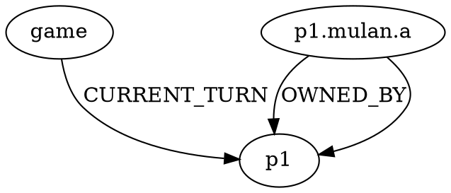

# Architecture

Graph-based game state engine for ML training data generation. Games are modeled as graphs, played to completion, and exported as self-contained episodes.

## Core Concepts

### Game State as Directed Graph

Game state represented as a **NetworkX MultiDiGraph**, serialized to DOT format.

**Nodes** represent game entities:
- Game metadata (turn counter, game over state)
- Players (lore, ink resources)
- Steps (turn phases: ready, set, draw, main, end)
- Card instances (created when drawn from deck)

**Edges** represent relationships and legal actions:
- **Structural**: `CURRENT_TURN`, `CURRENT_STEP`, `OWNED_BY` (card ownership)
- **Legal actions**: `CAN_PASS`, `CAN_INK`, `CAN_PLAY`, `CAN_QUEST`, `CAN_CHALLENGE`

Legal action edges are **computed from game rules** and stored on the graph, making the state self-documenting.

### Filesystem as Game Tree (optional)

With `--output-tree`, the full game tree is written to disk for debugging:

```
output/tree/<matchup-hash>/<shuffle-seed>/<action>/<action>/...
                                          └─ sequential action IDs (0, 1, 2...)
```

**Each directory = one game state**:
- `game.dot` - Complete graph (nodes + edges)
- `actions.txt` - Available actions from this state
- `diff.txt` - What changed from parent state
- `deck1.dek`, `deck2.dek` - Remaining cards in deck

Useful for inspecting intermediate states or debugging game logic.

### State Storage

Two storage backends for different use cases:

**MemoryStore** (default): States kept in memory only. Fast, no disk I/O. Episodes exported at game end.

**FileStore** (`--output-tree`): States written to disk as computed. Enables debugging, parallel exploration, and caching across runs.

### Deterministic Replay

**Matchup hash**: MD5 of deck contents → same decks = same hash
**Shuffle seed**: Hand specification (which cards go to each player) + RNG seed
**Action sequence**: Sequential indices, deterministically sorted

`same decks + same seed + same actions = identical game state`

Perfect for:
- Reproducible experiments
- Bug reports with exact game state
- Training data with consistent labeling

## Data Structures

### Node Schema

| type     | attributes                                       |
| -------- | ------------------------------------------------ |
| `Game`   | `turn`, `game_over`, `winner`                    |
| `Player` | `lore`, `ink_drops`, `ink_total`, `ink_available`|
| `Step`   | `player` (p1/p2), `step` (ready/set/draw/main/end) |
| `Card`   | `label`, `zone`, `exerted`, `damage`, `strength`, `willpower` |

**Card nodes** created when drawn from deck. Zone is an attribute (`hand`, `play`, `ink`, `discard`).

**Step nodes** (10 total: `step.p1.ready` through `step.p2.end`) represent turn phases. Used for temporal effects ("until end of turn").

### Edge Schema

**Structural**:
- `CURRENT_TURN`: Game → Player (whose turn)
- `CURRENT_STEP`: Game → Step (current phase)
- `OWNED_BY`: Card → Player (ownership)

**Action** (computed by rules engine):
- `CAN_PASS`: Player → Game (end turn)
- `CAN_INK`: Card → Player (add card to inkwell)
- `CAN_PLAY`: Card → Player (play from hand)
- `CAN_QUEST`: Card → Player (quest for lore)
- `CAN_CHALLENGE`: Card → Card (attacker → defender)

Each action edge has `action_type`, `action_id`, and `description` attributes.

### Action IDs

Sequential integers (0, 1, 2...) assigned deterministically:
1. Collect all legal actions
2. Sort by `(action_type, from_node, to_node)`
3. Enumerate → assign indices

**Properties**:
- No collisions
- Stable across runs (deterministic sort)
- Easy indexing for ML (`actions[0]`, `actions[1]`)

### File Formats

**game.dot** (DOT/Graphviz):

```dot
digraph {
    game [type="Game", turn="3"];
    p1 [type="Player", lore="5"];
    "p1.mulan.a" [type="Card", zone="play", exerted="0"];

    game -> p1 [label="CURRENT_TURN"];
    "p1.mulan.a" -> p1 [label="OWNED_BY"];
    "p1.mulan.a" -> p1 [action_type="CAN_QUEST", action_id="0"];
}
```

**actions.txt** (available moves):
```
0: quest:p1.mulan.a
1: ink:p1.elsa.b
2: pass
```

**diff.txt** (changes from parent):
```
# turn: 3
# current_player: p1
# action: play:p1.mulan.a
set node p1.mulan.a zone=play
```

**deck.dek** (cards remaining in deck):
```
p1.card_name.a
p1.card_name.b
```

## State Lifecycle

```
1. Initialize
   ├─ Load template graph (players, steps)
   ├─ Hash deck contents → matchup ID
   └─ Create initial game state

2. Shuffle
   ├─ Parse seed → which cards go to each hand
   ├─ Create card nodes with zone="hand"
   └─ Compute legal actions → add CAN_* edges

3. Play (GameSession)
   ├─ Apply action, compute new state
   ├─ Track state history (MemoryStore or FileStore)
   └─ Repeat until game over

4. Export (Episode)
   ├─ Stack all states into episode graph
   ├─ Write to output/episodes/<id>.episode/
   └─ Contains: graph.dot, history.txt, result.json, deck files
```

## Extension Points

### Adding New Mechanics

1. Create `lib/lorcana/mechanics/mechanic_name.py`:
   - `compute_can_X(G)` → list of legal action edges
   - `execute_X(state, from, to)` → mutate state graph

2. Register in `lib/lorcana/compute.py`:
   ```python
   edges_to_add.extend(compute_can_X(G))
   ```

3. Register in `lib/lorcana/execute.py`:
   ```python
   elif action_type == "CAN_X":
       execute_X(state, from_node, to_node)
   ```

Sequential action IDs assigned automatically.

### Custom Analysis Tools

Episode data accessible via standard tools:
- NetworkX for graph analysis (load `graph.dot`)
- JSON for metadata (`result.json`)
- DOT files viewable with Graphviz
- With `--output-tree`: `find`, `grep` for filesystem queries

### API/Programmatic Access

```python
from lib.lorcana.setup import create_initial_state
from lib.lorcana.game_api import GameSession
from lib.core.memory_store import MemoryStore

# Create initial state
state = create_initial_state("data/decks/deck1.txt", "data/decks/deck2.txt", seed="abc123")

# Play with in-memory storage (fast)
store = MemoryStore()
session = GameSession(state, store=store, root_key="abc123")

# Get available actions
actions = session.get_actions()  # [{'id': '0', 'description': '...'}, ...]

# Apply action by ID
session.apply_action("0")

# Play random until game ends
session.play_until_game_over()

# Get episode for export
episode = store.get_episode(session.current_key)
episode.to_episode_dir("output/episodes/my-game.episode")
```

## Episode Graphs

An **episode graph** combines all states from a complete game into a single graph, enabling temporal analysis. This is the `graph.dot` file in each `.episode` directory.

### Structure

Given a game with 4 states (initial + 3 actions):

```
State 0 (seed)     State 1 (action 0)     State 2 (action 1)     State 3 (action 2)
─────────────      ─────────────────      ─────────────────      ─────────────────
game@0 ──────next────▶ game@1 ──────next────▶ game@2 ──────next────▶ game@3
  │                      │                      │                      │
p1@0 ───────next────▶ p1@1 ───────next────▶ p1@2 ───────next────▶ p1@3
  │                      │                      │                      │
p1.card.a@0 ──next──▶ p1.card.a@1 ──next──▶ p1.card.a@2            ✕ (banished)
```

### Node Namespacing

Original node IDs get `@{state_index}` suffix:
- `game` → `game@0`, `game@1`, `game@2`, ...
- `p1.mulan.a` → `p1.mulan.a@0`, `p1.mulan.a@1`, ...

All original attributes preserved, plus `state_index` added.

### Edge Types

**Preserved edges** (namespaced): All edges from original states
```
game@2 --[current_turn]--> p1@2
p1.card.a@1 --[CAN_QUEST]--> p1@1
```

**Temporal edges** (new): Connect same entity across adjacent states
```
p1.card.a@0 --[next]--> p1.card.a@1
```

Temporal edges only exist when the entity exists in both states.

### Generation

Episode graphs are built automatically when games complete:

```bash
just generate-games 2 3  # Creates 6 .episode directories
```

Each `.episode` directory contains:
- `graph.dot` - The episode graph (all states stacked)
- `history.txt` - Human-readable diff sequence
- `result.json` - Winner, final lore, metadata
- `deck1.dek`, `deck2.dek` - Starting deck lists

Implementation: `lib/core/episode.py` and `lib/core/episode_graph.py`

## Design Principles

1. **Graph = source of truth**: Game state fully represented as a graph
2. **Deterministic = reproducible**: Same inputs → same outputs
3. **Self-contained episodes**: Each `.episode` has everything needed for analysis
4. **Pluggable storage**: MemoryStore for speed, FileStore for debugging
5. **Composable**: Standard formats (DOT, JSON) work with existing tools
